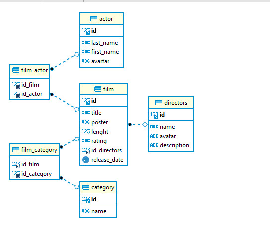

## Quản lý phim  
***Tạo bảng actor***  
```sql  
CREATE TABLE actor(
id INT PRIMARY KEY AUTO_INCREMENT,
last_name TEXT NOT NULL,
first_name TEXT NOT NULL,
avartar TEXT
)  
```  
***Tạo bảng directors***  
```sql  
CREATE TABLE directors(
id INT PRIMARY KEY AUTO_INCREMENT,
name TEXT NOT NULL,
avatar TEXT,
description TEXT NOT NULL
)
```  
***Tạo bảng category***  
```sql  
CREATE TABLE category(
id INT PRIMARY KEY AUTO_INCREMENT,
name TEXT NOT NULL
)
```  
***Tạo bảng film***  
```sql  
CREATE TABLE film(
id INT PRIMARY KEY AUTO_INCREMENT,
title TEXT NOT NULL,
poster TEXT NOT NULL,
lenght INT NOT NULL,
rating VARCHAR(10),
id_directors INT,
release_date Date,
FOREIGN KEY (id_directors) REFERENCES directors (id) 
)
```  
 ***Tạo bảng film_actor***  
```sql  
CREATE TABLE film_actor(
id_film INT, 
id_actor INT,
PRIMARY KEY (id_film, id_actor),
FOREIGN KEY (id_film) REFERENCES film (id),
FOREIGN KEY (id_actor) REFERENCES actor (id)
)
```  
 ***Tạo bảng film_actor***  
```sql  
CREATE TABLE film_category(
id_film INT, 
id_category INT,
PRIMARY KEY (id_film, id_category),
FOREIGN KEY (id_film) REFERENCES film (id),
FOREIGN KEY (id_category) REFERENCES category (id)
)
```  
